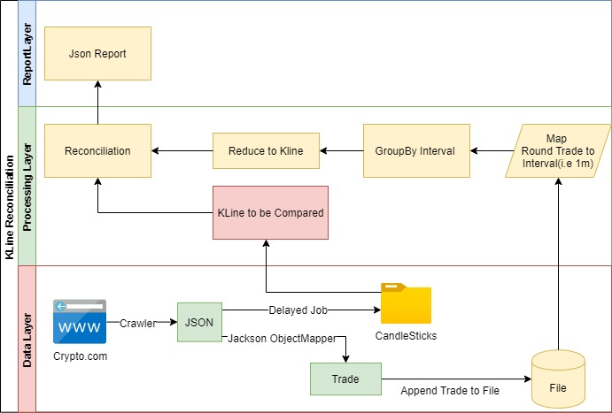
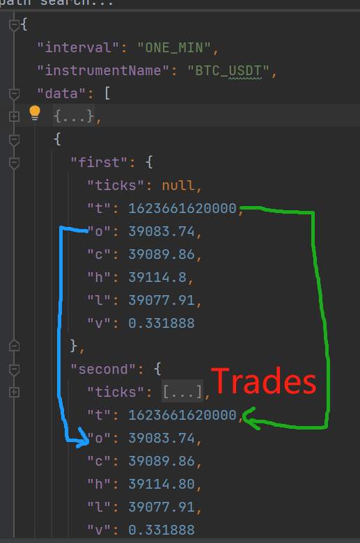

# Overall Design 
 


# How to Run
1. Start the main com.crypto.candlestick.CandlestickApplication with -Dspring.profiles.active=dev
   which will start two scheduled job in com.crypto.candlestick.marketdata.Crawler,
   ```
   @Scheduled(fixedRate = 1000 * 10) //every 10seconds  
   public void saveTradesToFile()

   //Inital delay to wait the trades to accumulate 20minutes, every 8hour,only need once
   @Scheduled(initialDelay = 1000*60*20, fixedRate = 1000 * 60 * 60 * 8)
   public void saveKlinesToFile()
   ```
   * **saveTradesToFile** will accumulate the trades and parse to Java and then save the json into tradesJsons.txt
   * **saveKlinesToFilea** with initial delay 20 seconds, to query the candlestick and save both them to files
   
# How to Reconcile
```java
@Test
    void recon() {
        ReconResult reconResult = kLineRecon.recon();
        List<Pair<CandleStick, CandleStick>> data = reconResult.getData();
        int size = data.size();
        LOG.info("Total size" + size);
        //Exclude the first and last one, as insufficient trades, only compare the ones in middle
        if(size > 2){
            for(int i = 1; i < (size -1); i++ ){
                Pair<CandleStick, CandleStick> pair = data.get(i);
                CandleStick first = pair.getFirst();
                CandleStick second = pair.getSecond();
                LOG.info(DateUtils.tsToDatetime(first.getTimestamp()).toString()) ;
                LOG.info(first.toString());
                LOG.info(second.toString());
                LOG.info(second.getTicks().toString());
                Assertions.assertTrue(first.getVolume().compareTo(second.getVolume()) == 0, "Volume not match");
                Assertions.assertTrue(first.getOpen().compareTo(second.getOpen()) == 0,"Open not match");
                Assertions.assertTrue(first.getClose().compareTo(second.getClose())==0,"Close not match");
                Assertions.assertTrue(first.getHigh().compareTo(second.getHigh())==0,"High not match");
                Assertions.assertTrue(first.getLow().compareTo(second.getLow())==0,"Low not match");
            }
        }
    }
```
1. Run the com.crypto.candlestick.core.KLineReconTest under test/java directory which would Assert the OCHL
and log the benchmark candlestick and generated candlestick,its underlying trades as json

2. Sample output
   * Sample output are under data/ouput directory
   * Reconcilation Result Json is useful to verify the consistency visually as show below   
     
# Get CandleStick examples

https://crypto.com/fe-ex-api/market-data/v2/public/get-candlestick?depth=1000&instrument_name=BTC_USDT&timeframe=1m
this url return 600, so 600 minutes range of trades, 10 hours
```java
public String getCandleSticks(String instrumentName, Interval interval) {
        String url = URL_BASE + "get-candlestick?depth=1000&instrument_name=" + instrumentName + "&timeframe=" + interval.getValue();
        return getJson(url);
    }
private String getJson(String url) {
        ResponseEntity<String> responseEntity = restTemplate.getForEntity(url, String.class);
        return responseEntity.getBody();
        }
```

# Get Trades examples

https://crypto.com/fe-ex-api/market-data/v2/public/get-trades?depth=1000&instrument_name=BTC_USDT
The trades are reversed ordered by ts
Due to the get-trades url only return the latest 200 trades, so start a scheduled job to query the trades 
every 10 seconds, parse the trades json to object and save to file tradesJsons.txt, reversely ordered, so keep the order
```java
    public List<Tick> getTrades(String instrumentName) {
        String url = URL_BASE + "get-trades?depth=1000&instrument_name=" + instrumentName;
        ResponseBase<Tick> tickResponseBase = JsonUtils.parseResponse(getInputStream(url), Tick.class);
        return tickResponseBase.getResult().getData();
    }
    private InputStream getInputStream(String url) {
        ResponseEntity<String> responseEntity = restTemplate.getForEntity(url, String.class);
        String body = responseEntity.getBody();
        return new ByteArrayInputStream(body.getBytes());
        }
```
# Use Jackson ObjectMapper map json to Domain Object
```java  
    public static <T> ResponseBase<T> parseResponse(InputStream inputStream, Class<?> cls) {
        JavaType responseType = objectMapper.getTypeFactory().constructParametricType(ResponseBase.class, cls);
        try {
        return objectMapper.readValue(inputStream, responseType);
        } catch (IOException e) {
        throw new RuntimeException(e);
        }
        }
    public static List<CandleStick> getCandleSticksFromFile(String fileName){
        try {
            InputStream inputStream = new ByteArrayInputStream(Files.readAllBytes(Paths.get(fileName)));
            ResponseBase<CandleStick> response = JsonUtils.parseResponse(inputStream, CandleStick.class);
            return response.getResult().getData();
        } catch (IOException e) {
            throw new RuntimeException(e);
        }
    }
    
```
# Use Trades List to generate KLine i.e 1m
* using Map Reduce
1. first round the timestamp to 1 minute by divide 60*1000,other interval likewise
2. group the tick into map
3. reduce the map to kline
```java
private Long roundToMin(Long ts) {
        return (ts / 1000 / 60 ) * 1000 * 60;  //End? time of candlestick (Unix timestamp)
        }
public NavigableMap<Long, CandleStick> generateKLine(List<Tick> ticks) {
        // Round timestamp to nearest of every interval(1m), ordered by ts
        // other intervals can be generated from 1m likewise
        NavigableMap<Long, CandleStick> groupedTicks = new TreeMap<>();

        Map<Long, List<Tick>> ticksToReduce = ticks.stream().map(mapToMin()).collect(Collectors.groupingBy(Tick::getTs));
        for (Map.Entry<Long, List<Tick>> e : ticksToReduce.entrySet()) {
            CandleStick candleStick = reduceToCandleStick(e.getValue());
            candleStick.setTimestamp(e.getKey());
            groupedTicks.put(e.getKey(), candleStick);
        }
        return groupedTicks;
    }
```

# Flink
* Alternative try use Flink to process the data in realtime
