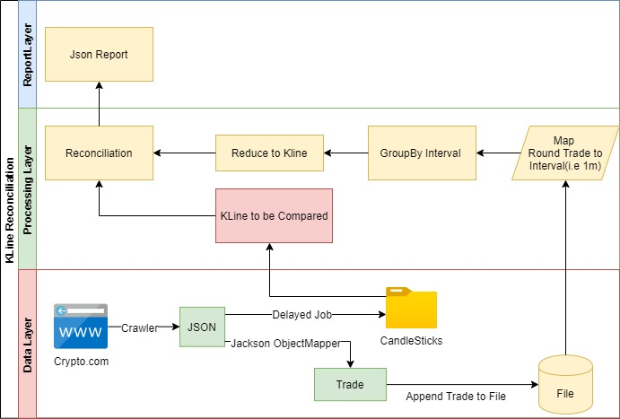

# Overall Design 



#How to Run
1. Start the main com.crypto.candlestick.CandlestickApplication 
   which will start two scheduled job in com.crypto.candlestick.marketdata.Crawler,
   ```
   @Scheduled(fixedRate = 1000 * 10) //every 10seconds  
   public void saveTradesToFile()

   //Inital delay to wait the trades to accumulate 20minutes, every 8hour,only need once
   @Scheduled(initialDelay = 1000*60*20, fixedRate = 1000 * 60 * 60 * 8)
   public void saveKlinesToFile()
   ```
   * saveTradesToFile will accumulate the trades and parse to Java and then save the json into tradesJsons.txt
   * saveKlinesToFilea with initial delay 20 seconds, to query the candlestick and save both them to files
   
#How to Reconcile
1. Run the com.crypto.candlestick.core.KLineReconTest under test/java directory which would Assert the OCHL
and log the benchmark candlestick and generated candlestick,its underlying trades
2. Sample output
   * Sample output are under test/java/com.crypto.candlestick.core.
# Get CandleStick examples

https://crypto.com/fe-ex-api/market-data/v2/public/get-candlestick?depth=1000&instrument_name=BTC_USDT&timeframe=1m
this url return 600, so 600 minutes range of trades, 10 hours
# Get Trades examples

https://crypto.com/fe-ex-api/market-data/v2/public/get-trades?depth=1000&instrument_name=BTC_USDT
The trades are reversed ordered by ts
Due to the get-trades url only return the latest 200 trades, so start a scheduled job to query the trades 
every 10 seconds, parse the trades json to object and save to file tradesJsons.txt, reversely ordered, so keep the order

# Use Jackson ObjectMapper map json to Domain Object

# Use Trades List to generate KLine i.e 1m
* using Map Reduce
1. first round the timestamp to 1 minute by divide 60*1000
2. group the tick into map
3. reduce the map to kline

# Alternative try use Flink to process the data
